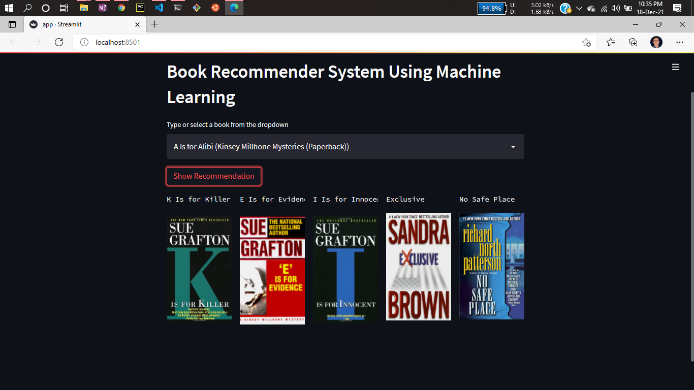

# Project: Book Recommender System Using Machine Learning! | Collaborative Filtering Based


Recommendation systems are becoming increasingly important in today’s extremely busy world. People are always short on time with the myriad tasks they need to accomplish in the limited 24 hours. Therefore, the recommendation systems are important as they help them make the right choices, without having to expend their cognitive resources.

The purpose of a recommendation system basically is to search for content that would be interesting to an individual. Moreover, it involves a number of factors to create personalised lists of useful and interesting content specific to each user/individual. Recommendation systems are Artificial Intelligence based algorithms that skim through all possible options and create a customized list of items that are interesting and relevant to an individual. These results are based on their profile, search/browsing history, what other people with similar traits/demographics are watching, and how likely are you to watch those movies. This is achieved through predictive modeling and heuristics with the data available.


 Collaborative Based :
		
- Collaborative filtering systems, which are based on user-item interactions.
	
- Clusters of users with same ratings , similar users .
	
- Book recommendation , so use cluster mechanism .
	
- We take only one parameter , ratings or comments .
	
- In short, collaborative filtering systems are based on the assumption that if a user likes item A and another user likes the same item A as well as another item, item B, the first user could also be interested in the second item . 
	
- Issues are :

	- User-Item nXn matrix , so computationally expensive .

	- Only famous items will get reccomended .

	- New items might not get reccomended at all .   


# Demo:





# Dataset has been used:

* [Dataset link](https://www.kaggle.com/ra4u12/bookrecommendation)

# How to run?
### STEPS:

Clone the repository

```bash
https://github.com/Saurabhxmodi79/Books-Recommender-System.git
```


#install the requirements
```bash
pip install -r requirements.txt
```


```bash
#run this file to generate the models

Books Recommender.ipynb
```

Now run,
```bash
streamlit run app.py
```


```bash
Author: Modi Saurabh	
Email: modisaurabh79@gmail.com
```


